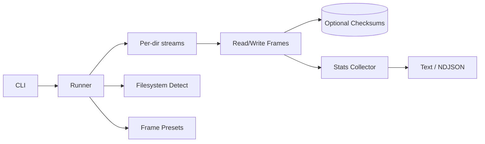

# Architecture

MediaIO is a Node.js/TypeScript CLI that benchmarks frame-style I/O across one or more directories, targeting both local filesystems and shared storage (NFS/SMB).

## Components
- **CLI (`src/index.ts`)**: argument parsing, validation, preset listing.
- **Runner (`src/runner.ts`)**: orchestrates producer/consumer loops, warm-up/duration controls, checksum option, per-stream + aggregate stats.
- **Stats (`src/stats.ts`)**: latency percentiles/histogram, throughput, drops/errors.
- **Filesystem (`src/filesystem.ts`)**: best-effort detection of fs type/local vs network.
- **Formats (`src/formats.ts`)**: cinematic presets and frame-size calculations.
- **Checksums (`src/checksum.ts`)**: optional per-file SHA-256 compute/verify.

## Data Flow
- CLI parses options → runner sets up per-dir streams → producer/consumer tasks write/read buffers → optional checksum files → stats collectors aggregate per interval → reporters emit text/NDJSON.

## Diagram

## Key Behaviors
- Warm-up frames are excluded from stats.
- Duration limit stops loops even if frames remain.
- Queue depth controls async concurrency; iosize used only in sync mode.
- Histogram optional to keep output light by default.
